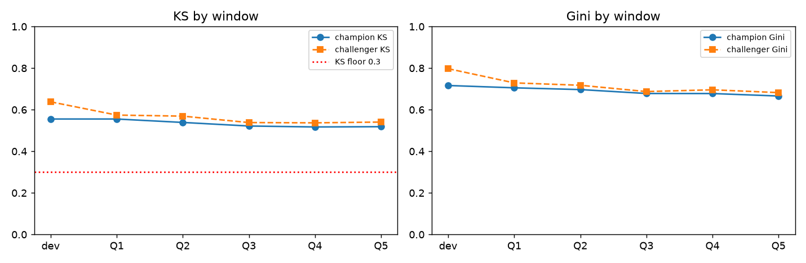
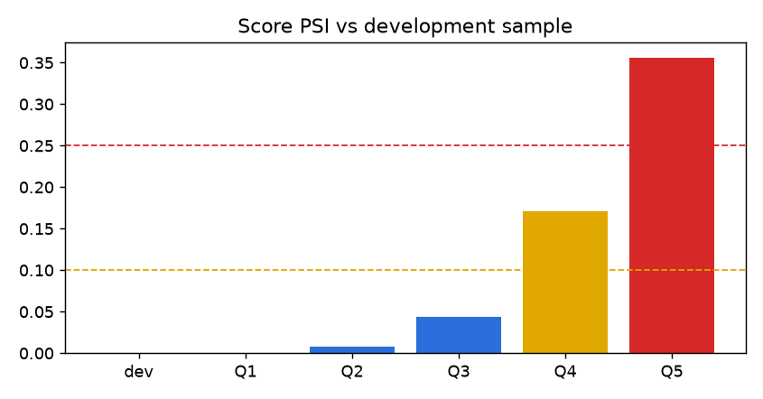

# model-risk-monitoring

A model-validation and ongoing-monitoring toolkit wrapped around the WOE / logistic credit scorecard from
[credit-risk-scorecard](https://github.com/lukefreyman-ai/credit-risk-scorecard), written in the spirit of the
Federal Reserve / OCC guidance on model risk management (SR 11-7 / OCC 2011-12): conceptual soundness, ongoing
monitoring, outcomes analysis, and a written report with findings an owner has to respond to.

What it computes for a champion scorecard and a gradient-boosting challenger across six windows:

- **Population Stability Index** of the score distribution vs. the development sample
- **Characteristic Stability Index** for every scorecard characteristic (bin-level shift)
- **Score-distribution drift** (band mix and bad rate by score band per window)
- **Discrimination tracking**: KS, Gini / AUC per window, relative decay vs. development
- **Calibration**: predicted vs. actual default rate by decile, portfolio-level gap, Hosmer-Lemeshow
- **Champion vs. challenger**: lift and decay of a gradient-boosted model trained on the same window
- **An HTML validation report** (`results/validation_report.html`) with RAG flags, findings and limitations, plus
  `MODEL_VALIDATION_REPORT.md` written as a first-year analyst would submit it.

Every number below is written by `python run.py` into `results/*.csv` and `results/metrics.json`; the tables here are
generated from those files.

## Data and the simulated time dimension

**Give Me Some Credit** (Kaggle, 150,000 borrowers, target `SeriousDlqin2yrs`, 6.68 % bad rate). The file needs a
Kaggle login, so it is not redistributed; put `cs-training.csv` in `data/`.

The dataset has no dates. To have something to monitor, rows are assigned to windows in `mrm/data.py`:

- **dev** = an unbiased random 40 % (the champion and challenger are built here);
- **Q1..Q5** = the remaining rows spread uniformly, then each window *thinned* with a documented tilt so that later
  windows over-represent high-utilisation, younger applicants and (Q4-Q5) worse outcomes - a stylised "digital
  acquisition + macro deterioration" story. Q1 has no tilt and acts as the control.

The tilts live in `config.yaml -> windows.drift` and are quoted in the report. **This is a simulation**: the metrics
are real computations on real borrower records, but the trend across windows is the injected shift, not history.

## Method

| component | what | where |
|---|---|---|
| Champion | 7 characteristics binned as in the scorecard repo, WOE-encoded (Laplace-smoothed), `statsmodels` Logit, points scaled 600 @ 50:1 odds, PDO 20 | `mrm/scorecard.py` |
| Challenger | `GradientBoostingClassifier` (300 trees, depth 4) on the raw, unbinned characteristics | `mrm/monitor.py` |
| Stability | PSI on score deciles of the dev sample; CSI on each characteristic's scorecard bins | `mrm/metrics.py` |
| Performance | KS, Gini, AUC per window; relative Gini drop vs dev | `mrm/metrics.py` |
| Calibration | decile table, portfolio gap, Hosmer-Lemeshow chi-square | `mrm/metrics.py` |
| Thresholds | PSI < 0.10 green / < 0.25 amber / else red; CSI 0.10; KS >= 0.30; Gini drop < 10 %; calibration gap <= 2 pp | `config.yaml -> thresholds` |
| Report | Jinja2 HTML with RAG-coloured tables, 4 charts, auto-generated findings, limitations | `mrm/report.py`, `templates/` |

## Results

Development sample: n = 59,819, KS 0.555, Gini 0.716 (challenger Gini 0.797).

| window | n | bad_rate | champion_ks | champion_gini | challenger_gini | score_psi | psi_rag | avg_pd | actual_minus_predicted | calibration_rag |
|---|---|---|---|---|---|---|---|---|---|---|
| dev | 59,819 | 6.78% | 0.555 | 0.716 | 0.797 | 0.000 | GREEN | 6.78% | -0.00 pp | GREEN |
| Q1 | 18,171 | 6.86% | 0.555 | 0.705 | 0.729 | 0.000 | GREEN | 6.80% | +0.06 pp | GREEN |
| Q2 | 15,716 | 7.04% | 0.539 | 0.697 | 0.718 | 0.007 | GREEN | 7.29% | -0.24 pp | GREEN |
| Q3 | 12,603 | 8.02% | 0.522 | 0.678 | 0.687 | 0.044 | GREEN | 8.27% | -0.25 pp | GREEN |
| Q4 | 9,467 | 10.51% | 0.517 | 0.678 | 0.696 | 0.171 | AMBER | 10.08% | +0.43 pp | GREEN |
| Q5 | 7,269 | 12.35% | 0.518 | 0.666 | 0.682 | 0.356 | RED | 11.87% | +0.48 pp | GREEN |

**CSI by characteristic and window** (amber >= 0.10):

| feature | dev | Q1 | Q2 | Q3 | Q4 | Q5 |
|---|---|---|---|---|---|---|
| age | 0.000 | 0.000 | 0.003 | 0.017 | 0.051 | 0.103 |
| debtratio | 0.000 | 0.000 | 0.000 | 0.003 | 0.003 | 0.006 |
| income | 0.000 | 0.000 | 0.000 | 0.002 | 0.002 | 0.011 |
| late30 | 0.000 | 0.000 | 0.001 | 0.002 | 0.014 | 0.026 |
| late60 | 0.000 | 0.000 | 0.000 | 0.002 | 0.008 | 0.020 |
| late90 | 0.000 | 0.000 | 0.000 | 0.003 | 0.012 | 0.032 |
| util | 0.000 | 0.000 | 0.008 | 0.047 | 0.195 | 0.403 |

Information value on the development sample:

| feature | iv |
|---|---|
| util | 1.1897 |
| late90 | 0.8934 |
| late30 | 0.7915 |
| late60 | 0.6245 |
| age | 0.2761 |
| income | 0.0617 |
| debtratio | 0.0318 |

 

**Overall assessment: RED.** Findings written by the code:

- **HIGH** - Score PSI reaches 0.356 in Q5 (> 0.25): the scored population has shifted materially from development. Investigate acquisition mix before trusting cut-offs.
- **MEDIUM** - Characteristic drift: 3 feature-window pairs breach CSI 0.1; largest is util in Q5 (CSI 0.403). These characteristics drive the score shift.
- **LOW** - Champion KS stays above 0.3 (range 0.517-0.555); Gini relative drop vs development at most 7.1 %.
- **LOW** - Portfolio-level calibration holds: |actual - predicted| default rate <= 2 pp in every window.
- **INFO** - Challenger (gradient boosting) Gini exceeds the champion by 2.8 pts on average (+0.9 to +8.1) and its relative decay across windows is 14.4 % vs 7.1 % for the champion. Lift alone does not justify replacement: the challenger is not reason-code explainable and would need a full validation cycle.

## Key decisions

- **PSI on the score, CSI on the characteristics, in that order.** PSI tells you *whether* the scored population
  moved; CSI tells you *which input* moved it. Here the score PSI goes 0.171 (Q4) -> 0.356 (Q5) and the CSI table
  points straight at utilisation (0.403 in Q5) with age a distant second - which is exactly the shift that was injected.
- **Stability and performance are separate questions.** The population drifted materially but KS stayed at
  0.518 and the Gini drop is under 7 %: the model still *ranks* correctly. The right response is a
  review of cut-offs and approval rates, not a rebuild. Treating a red PSI as "the model is broken" is a common mistake.
- **Calibration is checked as an absolute gap, not a p-value.** Hosmer-Lemeshow rejects almost everything at 10,000+
  rows. A 2 pp portfolio gap is something a pricing team can act on.
- **The challenger is a yardstick, not a candidate.** A +2.8-pt Gini lift that decays faster than the champion
  (14 % vs 7 %) is not a case for replacing an explainable scorecard - it's evidence about how much signal the
  linear model leaves on the table.
- **Unbiased development window.** The first version of the simulation drew all windows competitively and drained
  bad outcomes out of the development sample (its bad rate fell to 3.5 %). Development must be representative or every
  downstream metric is wrong - so the dev window is now drawn first, at random.

## Limitations

- The time dimension is simulated (see above). Real monitoring would use booking cohorts and a 24-month
  performance window, which means KS/Gini lag PSI by two years.
- Thresholds are industry rules of thumb, not calibrated to this portfolio's economics.
- No override analysis, reject inference, or fair-lending testing - all required in a production validation.
- The challenger is untuned and shares the dev window; its lift is illustrative.

## How to run

```bash
git clone https://github.com/lukefreyman-ai/model-risk-monitoring && cd model-risk-monitoring
make setup                       # venv + pip install -r requirements.txt
# download cs-training.csv from https://www.kaggle.com/c/GiveMeSomeCredit/data into data/
make run                         # ~20 s -> results/validation_report.html, results/*.csv, results/*.png
make test                        # 4 tests (metrics + end-to-end on synthetic data)
make smoke                       # synthetic data, no Kaggle download
```

## Repo layout

```
run.py                         entry point; purpose / soundness / limitations text lives here
config.yaml                    data path, window simulation tilts, RAG thresholds, scorecard bins, challenger params
mrm/data.py                    GMSC loader, window assignment (thinning), synthetic frame for tests
mrm/scorecard.py               WOE/IV binning, logistic scorecard, points table
mrm/metrics.py                 PSI, CSI, KS, Gini, calibration, Hosmer-Lemeshow, RAG helper
mrm/monitor.py                 runs the monitoring pack across windows (champion + challenger)
mrm/report.py                  plots, findings, overall RAG, HTML rendering
templates/report.html.j2       report template
MODEL_VALIDATION_REPORT.md     the written report (analyst voice)
results/                       committed outputs of the last run
```
